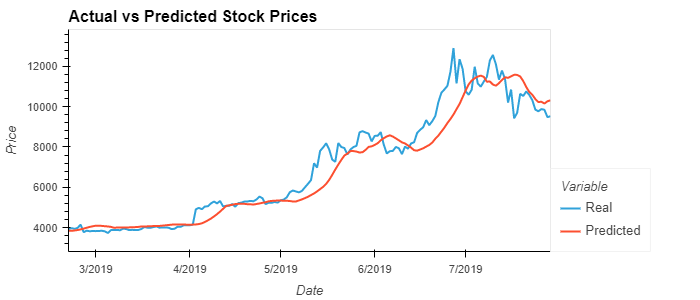
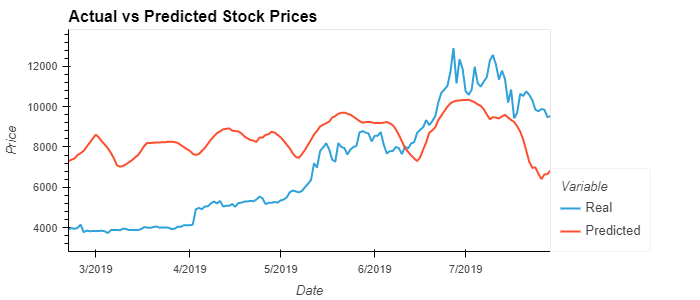

<h1 align="center">Stock Predictor</h1>
<h2 align="center"> LSTM model in Deep Learning</h2>

—≡₪ Using Fear and Greed Index ₪≡—  

—≡₪ Using Closing Prices ₪≡— 

  
    <section></section>    
    <section> <b> By: Ebad Salehi </b> </section>

  

## Summary    
    
This is the Assignmnets for unit-14: Deep-learnign. The LSTM model is used to train the AI to make stock predictions based on:
* Fear and Greed Index 
* Closing Prices

 

    
## LSTM Results Charts

  
    <section>
        
        
    </section>
    

  
 

    
## Technologies Used:
    
* Jupyter-lab
* VS Code
* Python    
* Scikit-learn    
* Keras
* tensorflow
* numpy
* hvplot

 

    
## Author:

Ebad Salehi

 

(<a href="#top">Back to top</a>)

    

 
